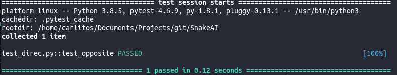

# Snake
> Benzon Carlitos Salazar

### About
This repo focuses on the artificial intelligence of the 
[Snake](https://en.wikipedia.org/wiki/Snake_(video_game_genre)) game.
The algorithms used are the Shortest Path (which uses a 
[breadth-first search](https://en.wikipedia.org/wiki/Breadth-first_search)
approach) and the 
[Longest Path Problem](https://en.wikipedia.org/wiki/Longest_path_problem).
I also implement a [Greedy](https://en.wikipedia.org/wiki/Greedy_algorithm)
 approach which directs the snake to eat the food along the shortest path if it
 thinks the snake will be safe. Otherwise, it will let the snake wander around
until a safe path can be found.

### Tests
Test cases implemented so far are all for the basic functions of 
the snake game. Future implementations will include test cases
for all the algorithms used.
* [Test Folder](./tests)
	* [Testing the Direction](./tests/base/test_direc.py)
	
	* [Testing the Map](./test/base/test_map.py)
	